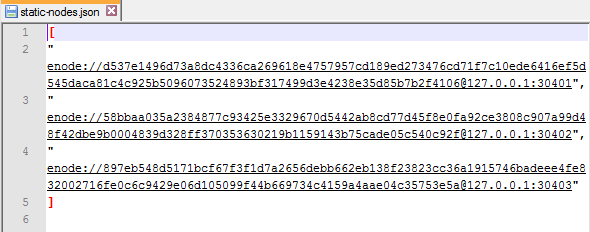

# Hierarchical Distributed Ledger for Sensor Data Using Ethereum Blockchain

This Project is a hypothetical demonstration of how we can maintain a distributed ledger of data in a private Ethereum Blockchain by employing a use case in IOT domain. It is the final year project of my undergrad degree.

### Problem
In the domain of Internet of things there are large number of devices generating data in the network and submitting it to their respective configured data collectors. If the sensors are preconfigured by the data collectors, they can easily verify the data coming from those sensors for its authenticity. But if a third party wants to buy that data, how can they trust the data collector for the authenticity of that data i.e the data they are buying is real data or randomly generated stream of numbers. In fact, the only option left is to trust the claim made by the collectors that the data they are providing is authentic. This project resolves the trust issue by creating a distributed application using blockchains by distributing the trust factor to the entire network instead of trusting a single entity. This project provides authenticity of data generated by sensor nodes in the network.

### The Dapp
This Blockchain project is based on Ethereum platform which is an open-source, blockchain-based distributed computing platform and operating system featuring smart contract functionality.
Demonstration Video : https://www.youtube.com/watch?v=2Jb1sC-yh1k&t=212s

### Distributed nature
It is a distributed application (dApp) running simultaneously on each node of the network to keep the system running and so the consensys of the nodes decides the copy of the blockchain to be shared among the nodes. Applications mentioned below are installed on each node individually and any number of such nodes can take part into the network. The applications installed are to be replicated on each node of the distributed network.

### Specification
Each node stores a copy of blockchain and blockchain grows linearly over time. Maintaining a copy of blockchain requires a significant disk space (from MBs to GBs).
Minimum requirements are 1 GB Ram and 10 GB HDD to begin with.

Hardware Required (One can change the configuration as per requirements)
3 Computer Machines
5 Raspberry Pis

### Installation of required Packages
(Steps for installing the packages on computers and Rpi is similar)

#### Geth

    sudo apt-get install -y software-properties-common
    sudo add-apt-repository -y ppa:ethereum/ethereum
    sudo apt-get update
    sudo apt-get install -y ethereum
    geth version

#### Mqtt

    sudo apt-add-repository ppa:mosquitto-dev/mosquitto-ppa
    sudo apt-get update
    sudo apt-get install mosquitto
    sudo apt-get install mosquitto-clients

paho-mqtt (python dependency on sensor nodes to publish data)

    pip install paho-mqtt

“publishmydata.py” file on each sensor node is used to publish pseudo sensor data in real time to the farm managers over the mqtt protocol.

### Creation of Private Blockchain

#### Initialise Blockchain with custom genesis block
    
    Custom Genesis File,
    {
     "nonce": "0x0000000000000042",
     "mixhash": "0x0000000000000000000000000000000000000000000000000000000000000000",
     "difficulty": "0x40000",
     "alloc": {},
     "coinbase": "0x0000000000000000000000000000000000000000",
     "timestamp": "0x00",
     "parentHash": "0x0000000000000000000000000000000000000000000000000000000000000000",
     "extraData": "0x436861696e536b696c6c732047656e6573697320426c6f636a",
     "gasLimit": "0xffffffff",
     "config": {
        "chainId": 101,
        "homesteadBlock": 0,
        "eip155Block": 0,
        "eip158Block": 0
     }
    }

Init Node command : geth --datadir path/to/custom/data/folder init genesis.json        
Add account command : geth --datadir path/to/custom/data/folder account new

#### Start the node in terminal

    geth --datadir path/to/custom/data/folder --networkid 15

#### Create a file ‘static-nodes.json’ in the blockchain folder of each node.

This file is required to connect the nodes in the network whenever they are live.
Copy enode address and IP address in this file. This will be placed in blockchain folder of each node. Put the respective enode address and IP address of each node separated by commas. And each Blockchain will have a different copy bu the nodes in the same blockchain will share the same copy of static-nodes.

#### Restart the node to reflect the connection with appropriate credentials.
    
    geth --identity "node1" --datadir DataBC --networkid 101 --nodiscover --rpc --rpcport 8042 --rpccorsdomain "*" --rpcapi "eth,web3,personal,admin,miner" --port 30402 --ipcpath DataBC/geth/geth.ipc

This way each individual node is started with same network ID and different ports (if simulated on same machine) or same ports if different machines.
Query net.peercount on geth terminal on any node to get the number of connected peers in any blockchain.

### Executing the DApp

Once the blockchain is created and connection between the nodes is established we can now run the bash files on each node (which contains the command for starting the node) and open the web pages for each node in the Interface folder to interact with it.

#### Interacting with the DApp

The System Architecture (Names used are for demonstration purpose only)

So the farm manager is a part of Local as well as the Global Blockchain.
Geth node port number, network Id and the RPC port number are the parameters used by web3js for interacting with each individual geth node.

The above shown is the architecture which we are following, considering 3 farm managers and 5 sensor nodes. Each Farm Manager has 2 addresses, one global and another local address as they are part of both global as well as the local blockchain network.

When the nodes are successfully running we need to deploy the smart contracts and then interact with the smart contract from geth javascript console to populate data into the blockchain from the sensor nodes so that the farm managers can then do transactions of those data in exchange of ethers in a bidding fashion.
The dapp must be running as shown in the video linked above and UI snapshots of project available in the screenshot folder.

#### Smart Contracts

There are 2 smart contracts written for this project. Both available in the contracts folder along with the compiled web3 deploy file to deploy it using geth terminal. FarmData.sol is written for the local blockchain which is to be deployed on each local regional blockchain to maintain ledger transactions between sensor nodes and the farm manager within the farm. And BidData.sol  is written for the global blockchain where all the farm managers trade the aggregated data and is to be deployed only once globally.

### Acknowledgement

This project was created with the support of my friend Kshitiz Srivastava who helped me to setup & configure Raspberry Pi(s) and assisted in network configuration. It was done under the guidance of Prof. Ashwini Dalvi as well as Prof. Irfan Siddavatam of K. J. Somaiya College of Engineering, Mumbai.
